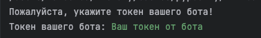

# Holiday Bot

В рамках нашего курса мы с вами напишем телеграм-бот, в котором можно будет посмотреть официальные праздники, а также добавить свои. Будем осваиваться в гите с нуля, поэтому в первых нескольких заданиях акцент будет сделан не на запуск самого бота, а на работу с гитом и с базовыми структурами питона. Затем, где-то к середине модуля, вы уже сможете запустить бота и дальнейшие доработки вносить уже поверх работающего бота.

## Задание 1. Осваиваем git

#### Контекст:

В рамках большого проекта по созданию телеграм-бота нам необходимо обеспечить корректное преобразование названий месяцев из текстового формата в числовой для дальнейшей обработки их под капотом нашего бота.

#### Цель задания:

Давайте представим, что наш коллега уже начал вносить данные по месяцам до нас, но устал на половине работы. Вам необходимо дополнить уже созданный словарь, который сопоставляет необходимые текстовые варианты написания месяца с его номером. Этот словарь будет использоваться далее в программе для форматирования даты и вывода информации о праздниках в удобочитаемом виде.

#### Что нужно сделать:

В файле `holiday_bot/dates.py` уже описана половина нашего словаря, с января по июнь. Ваша задача - дописать данные по оставшимся месяцам и отправить изменения на Gitlab. Для этого:

1. Склонируйте репозиторий задания к себе на компьютер. Это делается консольной командой `git clone git@gitlab.dc.bmstu.ru:all-python/python/holiday_bot.git`
2. Создайте свою новую ветку и переключитесь на неё: `git checkout -b 01-months-dict`
3. Откройте в IDE файл `holiday_bot/dates.py` и добавьте в словарь `months_dict` недостающие месяцы в том же формате, в котором представлены уже добавленные месяцы.
4. Добавьте измененный файл в отслеживание гита: `git add holiday_bot/dates.py`
5. Закоммитьте изменения в гит: `git commit -m 'здесь добавьте своё пояснение к коммиту'`
6. Отправьте коммит на сервер гитлаба: `git push`
7. Создайте новый Merge Request в ветку `master` в репозитории проекта.
8. Когда тесты отбегут без ошибок, замержьте ветку в мастер, нажав кнопку Merge.
9. Если вы хотите продолжать делать следующие задания в этом же репозитории, отведите тег v1. (рекомендуем делать так)

## Задание 2. Регулярные выражения

### Контекст:

Регулярные выражения это великий и ужасный инструмент, который нам нужен в телеграм боте для проверки дат на корректность указанного шаблона.

### Цель задания:

Представим, что прошлое задание выполнили не вы, а ваш не самый внимательный коллега и допустил ошибки в формате даты, а так же мы хотим проверять входные даты от пользователей.
В этом нам могут помочь регулярные выражения.

#### Что нужно сделать:

В файле `holiday_bot/helper.py` определены две константы и нужно вписать в них правильное регулярное выражение для проверки дат.
REGEX_DATE_WITH_DOT - для дат в формате - YYYY.MM.DD и REGEX_DATE_WITH_DASH - для дат - YYYY-MM-DD


## Задание 3.1. Функции

### Контекст:

В рамках проекта нам необходимо использовать функции, чтобы повторно использовать код, разделять логику на понятные части и упрощать поддержку программы.

### Цель задания:

Научившись писать регулярные выражения, можем попробовать использовать это выражения и написать функцию для проверки формата входной даты.
Учитывая контекст проекта, так же нужно смотреть, мы так же должны отсекать даты больше сегодняшнего дня(из будущего).

#### Что нужно сделать:

В файле `holiday_bot/helper.py` нужно дописать функцию `validate_date`, которая на вход принимает дату в виде строки, а на выходе выдает булевое значение True, если оно подходит по формату YYYY-MM-DD и не больше сегодняшнего дня.
Если же строка не подходит под наши условия, то возвращаем False

## Задание 3.2. kwarg & args

### Контекст:

Получив рабочую функцию, мы можем понять, что нам недостаточно опций у нашей функции и нам необходимо расширить/поменять возможный функционал.

### Цель задания:

Сделав функцию проверки, мы поняли, что нам так же нужно не только проверять корректна ли дата под наши условия, но и выдавать все даты, которые удовлетворяют условия.
Так же, мы можем захотеть расширить обрабатываемый формат дат и должны добавить такую возможность. 

#### Что нужно сделать:

В файле `holiday_bot/helper.py` нужно написать функцию `get_validated_dates` и `get_validated_dates_with_formats`.
Функция `get_validated_dates` принимает на вход `*inputs_date` - это список дат`['2025-01-27', ...]`, которые мы хотим проверить и вернуть список дат прошедших условия.
Функция `get_validated_dates_with_formats` получает на вход `**kwargs` с параметрами `dates` и `formats` и там дополнительно к датам мы хотим дополнительно передавать возможные форматы дат и так же на выходе получить список дат прошедших условия. 
Условия как из прошлого задания - (подходит по формату YYYY-MM-DD и не больше сегодняшнего дня), а для функции `get_validated_dates_with_formats` форматы нужно брать из списка в параметрах kwargs.

## Задание 3.3. Отладка функций

### Контекст:

Всегда при работе над большим нам может понадобиться довести до рабочего состояния полученный код и это может быть как незадачливый коллега из первого задания, так и ты сам после длительного отпуска -_-

### Цель задания:

Теперь нам нужно научиться разбираться и находить ошибки в чужом коде. В большинстве случаев, приходя на работу вы будете в том или ином виде работать с чужим кодом или использовать существующий фреймворк.
В нашем случае будет работа с проектом телеграм-бота.

#### Что нужно сделать:

Данны две функции `get` и `get_list`, `get` - возвращает список официальных и заданных пользователем праздников на дату в формате одной строки, а `get_list` списка праздников на заданную дату.
Нужно поправить все ошибки в функциях `get` и `get_list` и учесть возможные ошибки, как пример - деление на ноль или обращение к пустому списку.

## Задание 3.4. Декомпозиция функций

### Контекст:

Правив в двух функциях похожий код в прошлом задании, вы возможно заметили повторяющийся код, логично было бы вынести повторяющийся код и править код только в одном месте, ведь так было бы лаконичнее и проще. 

### Цель задания:

Нужно научится замечать повторяющуюся логику в проекте - это довольно частая задача в проектах, когда ты написал какую-то часть кода и делаешь рефакторинг разделяя большие куски и вынося повторяющийся код в функции.

#### Что нужно сделать:

Нужно вынести закомментированную часть в функцию `get_custom_holidays_on_day_of_month` которая на вход получает дату и словарь из кастомных праздников, а на выходе выдает лист из праздников в этот день, не учитывая год.

## Задание 4. Контекстный менеджер with
### Контекст:

При работе с файлами, сетевыми соединениями или базами данных важно правильно закрывать ресурсы после использования. Если забыть это сделать - программа может зависнуть, потерять данные или заблокировать доступ к файлу. В Python для этого существует конструкция with, которая автоматически управляет открытием и закрытием ресурсов.

### Цель задания:

Научиться безопасно работать с файлами с помощью конструкции with, чтобы код был надёжным и не требовал ручного закрытия файлов.

### Что нужно сделать:

В файле holiday_bot/io_utils.py нужно написать функцию read_holidays_from_file, которая:
принимает на вход название JSON-файла с праздниками,
с помощью конструкции with открывает файл,
читает его содержимое,
возвращает данные в виде словаря.
Пример вызова:

```
data = read_holidays_from_file("custom_holiday.json")
print(data)
```
* Используйте `encoding="utf-8"` и `json.load()`
* Важно - используете `Path(__file__)` для прописывания пути к файлу

## Задание 5. Вынесение кода в отдельный модуль
### Контекст:

Как уже обсуждали, важно выносить повторяющийся код в функции, но чтобы было удобно использовать эти наработки в нескольких местах, его нужно вынести в отдельный модуль (вспомогательная папка с файлом), чтобы упростить поддержку и тестирование.

### Цель задания:

Научиться, выносить код в отдельный модуль (helper.py) и директорию/пакет (utils).

### Что нужно сделать:

Нужно создать новый модуль helper внутри пакета utils `utils/helper.py` в директории проекта holiday_bot `holiday_bot/utils/helper.py`. 

В модуле `holiday_bot/utils/helper.py` нужно реализовать функцию `get_today_str()`, которая возвращает дату на текущий день в формате строки ГГГГ-ММ-ДД 

* Вызов функции должен сработать при импорте - `from holiday_bot.utils.helper import get_today_str`

## Задание 6.1. Метод get_list

### Контекст:

Переходим к изучению объектно-ориентированного программирования (ООП). В рамках проекта телеграм-бота мы будем работать с классом `MyHolidays`, который наследуется от класса `Russia` из библиотеки `holidays`. Это позволит нам работать как с официальными, так и с кастомными праздниками.

### Цель задания:

Научиться работать с классами, наследованием и методами. В этом задании вы реализуете метод, который возвращает раздельные списки официальных и кастомных праздников для указанной даты.

#### Что нужно сделать:

В файле `holiday_bot/custom_holiday.py` реализован класс `MyHolidays` с методом `get_list()`. Этот метод должен:

1. Принимать на вход объект `date` (дату)
2. Возвращать кортеж из двух списков: `(официальные_праздники, кастомные_праздники)`
3. Официальные праздники получаются из родительского класса `Russia` через вызов `super().get(date_obj, [])`
4. Кастомные праздники ищутся в словаре `self.custom_holidays` по месяцу и дню (год игнорируется)

Пример использования:
```python
from datetime import date
from holiday_bot.custom_holiday import MyHolidays

obj = MyHolidays()
official, custom = obj.get_list(date(2025, 1, 1))
print(f"Официальные: {official}")
print(f"Кастомные: {custom}")
```

#### Что проверяют тесты:

- Метод возвращает кортеж из двух списков
- Официальные праздники корректно извлекаются
- Кастомные праздники корректно извлекаются
- Для дат без праздников возвращаются пустые списки
- Год игнорируется при поиске кастомных праздников

## Задание 6.2. Конструктор класса

### Контекст:

Конструктор `__init__()` — это специальный метод класса, который автоматически вызывается при создании нового объекта. В нём происходит инициализация атрибутов объекта — переменных, которые будут хранить данные для конкретного экземпляра класса.

### Цель задания:

Научиться правильно инициализировать атрибуты объекта в конструкторе. В предыдущем задании конструктор уже был частично реализован (вызов `super().__init__()` и загрузка `custom_holidays`). В этом задании нужно дополнить его инициализацией счётчика загруженных праздников.

#### Что нужно сделать:

В файле `holiday_bot/custom_holiday.py` в классе `MyHolidays` нужно дополнить конструктор `__init__()`. 

На предыдущем шаге уже было добавлено:
- `super().__init__(**kwargs)` - инициализация родительского класса `Russia`
- `self.custom_holidays = self._load_custom_holidays()` - загрузка кастомных праздников

Теперь добавьте: иницилизацию атрибута **класса** `loaded_count ` - инициализация счётчика загруженных праздников

Пример использования:
```python
from holiday_bot.custom_holiday import MyHolidays

# Создание объекта - вызывается конструктор __init__
obj = MyHolidays()

# Проверяем, что атрибуты инициализированы
print(f"Загружено праздников: {obj.get_loaded_count()}")
print(f"Тип custom_holidays: {type(obj.custom_holidays)}")
```

#### Что проверяют тесты:

- Конструктор корректно создаёт объект класса
- Атрибут `custom_holidays` инициализирован и является словарём
- Атрибут `loaded_count` инициализирован и равен 0
- Родительский класс `Russia` корректно инициализирован
- Метод `get_loaded_count()` работает без ошибок

## Задание 6.3. Исправление инициализации атрибута

### Контекст:

В процессе разработки часто возникает ситуация, когда атрибут объекта инициализируется не в конструкторе, а в каком-то другом методе. Это может привести к ошибкам, если метод, использующий этот атрибут, вызывается до метода, который его инициализирует. Правильная практика — инициализировать все атрибуты объекта в конструкторе `__init__()`.

### Цель задания:

Исправить ошибку в инициализации атрибута `loaded_count`. Сейчас он инициализируется в методе `_load_custom_holidays()`, но используется в методе `get_loaded_count()`. Это нарушает принцип явной инициализации атрибутов в конструкторе.

#### Что нужно сделать:
В файле `holiday_bot/custom_holiday.py` в классе `MyHolidays` нужно исправить порядок инициализации атрибута `loaded_count`:

1. В конструкторе `__init__()` инициализируйте атрибут `loaded_count` с начальным значением **до** загрузки праздников
2. В методе `_load_custom_holidays()` обновите значение счётчика на основе количества загруженных праздников
3. Подумайте, какое значение должен иметь атрибут, если загрузка не удалась

#### Зачем это нужно:

- **Явность инициализации**: все атрибуты объекта видны в одном месте (в `__init__`)
- **Безопасность**: атрибут всегда существует, даже если произошла ошибка при загрузке
- **Предсказуемость**: метод `get_loaded_count()` всегда будет работать корректно

#### Что проверяют тесты:

- Атрибут `loaded_count` инициализирован со значением 0 в конструкторе
- После загрузки праздников `loaded_count` обновляется корректно
- Метод `get_loaded_count()` возвращает актуальное значение
- При пустом файле или ошибке загрузки `loaded_count` остаётся равным 0
- Порядок инициализации атрибутов корректен

## Задание 6.4. Атрибуты класса vs атрибуты объекта

### Контекст:

В Python существует важное различие между атрибутами класса и атрибутами объекта (экземпляра). **Атрибуты класса** — это переменные, которые принадлежат самому классу и являются общими для всех объектов этого класса. **Атрибуты объекта** — это переменные, которые принадлежат конкретному объекту и уникальны для каждого экземпляра.

### Цель задания:

Понять разницу между атрибутами класса и объекта на практике. В этом задании вы добавите атрибут класса `total_holidays_loaded`, который будет хранить общее количество загруженных праздников через все созданные объекты класса `MyHolidays`.

#### Что нужно сделать:

В файле `holiday_bot/custom_holiday.py` в классе `MyHolidays`:

1. Добавьте атрибут класса `total_holidays_loaded = 0` на уровне класса (не в `__init__`)
2. В методе `_load_custom_holidays()` обновляйте этот атрибут: `MyHolidays.total_holidays_loaded += len(custom_hols)`
3. Добавьте метод класса `get_total_holidays_count()` с декоратором `@classmethod` для получения этого значения

#### Разница между атрибутами класса и объекта:

| Характеристика | Атрибут класса | Атрибут объекта |
|---|---|---|
| **Где определяется** | На уровне класса | В методе `__init__()` |
| **Как обращаться** | `ClassName.attr` или `self.attr` | `self.attr` |
| **Общий или уникальный** | Общий для всех объектов | Уникальный для каждого объекта |
| **Пример использования** | Счётчик всех созданных объектов | Имя конкретного пользователя |

Пример:
```python
# Атрибут класса - общий для всех объектов
obj1 = MyHolidays()  # total_holidays_loaded увеличился на 5
obj2 = MyHolidays()  # total_holidays_loaded увеличился ещё на 5 (теперь 10)

# Атрибут объекта - уникальный для каждого
print(obj1.loaded_count)  # 5 - количество праздников в obj1
print(obj2.loaded_count)  # 5 - количество праздников в obj2
print(MyHolidays.total_holidays_loaded)  # 10 - общее количество
```

#### Что проверяют тесты:

- Атрибут класса `total_holidays_loaded` определён на уровне класса
- Атрибут класса корректно обновляется при создании новых объектов
- Метод `get_total_holidays_count()` является методом класса (`@classmethod`)
- Атрибут класса накапливает значения при создании нескольких объектов
- Атрибут объекта `loaded_count` остаётся уникальным для каждого экземпляра

## Задание 6.5. Исправить static и classmethod

### Контекст:

В Python существуют специальные декораторы для методов: `@staticmethod` и `@classmethod`. **Статический метод** (`@staticmethod`) — это метод, который не использует `self` или `cls` и не зависит от состояния объекта или класса. **Метод класса** (`@classmethod`) — это метод, который работает с классом, а не с конкретным объектом, и принимает первым параметром `cls` (ссылку на класс).

### Цель задания:

Научиться различать, когда метод должен быть обычным методом объекта, статическим методом или методом класса. В этом задании вы исправите два метода, добавив к ним правильные декораторы.

#### Что нужно сделать:

В файле `holiday_bot/custom_holiday.py` в классе `MyHolidays` исправьте два метода:

1. `_parse_date_string()` — метод не использует `self` или `cls`, поэтому должен быть `@staticmethod`
2. `get_total_holidays_count()` — метод работает с атрибутом класса `total_holidays_loaded`, поэтому должен быть `@classmethod` с первым параметром `cls`

#### Когда использовать какой тип метода:

| Тип метода | Декоратор | Первый параметр | Когда использовать |
|---|---|---|---|
| **Обычный метод** | Нет | `self` | Работает с данными конкретного объекта |
| **Метод класса** | `@classmethod` | `cls` | Работает с атрибутами класса |
| **Статический метод** | `@staticmethod` | Нет | Не зависит от класса или объекта |

Пример:
```python
class Example:
    class_var = 0
    
    def __init__(self):
        self.instance_var = 10
    
    def instance_method(self):
        # Обычный метод - работает с self
        return self.instance_var
    
    @classmethod
    def class_method(cls):
        # Метод класса - работает с cls
        return cls.class_var
    
    @staticmethod
    def static_method(x, y):
        # Статический метод - не использует ни self, ни cls
        return x + y
```

#### Что проверяют тесты:

- Метод `_parse_date_string()` является статическим методом
- Статический метод корректно парсит строку даты
- Статический метод можно вызвать через класс: `MyHolidays._parse_date_string('2024-01-01')`
- Метод `get_total_holidays_count()` является методом класса
- Метод класса корректно возвращает значение атрибута класса
- Метод класса можно вызвать через класс: `MyHolidays.get_total_holidays_count()`
- Методы имеют правильные сигнатуры

## Задание 6.6. Добавить property

### Контекст:

В Python существует специальный декоратор `@property`, который позволяет обращаться к методу как к атрибуту, не используя скобки для вызова. Это полезно, когда нужно вычислять значение на лету или добавить дополнительную логику при получении атрибута, сохраняя при этом удобный синтаксис доступа.

### Цель задания:

Научиться использовать декоратор `@property` для создания вычисляемых атрибутов. В этом задании вы реализуете свойство `custom_holidays_count`, которое будет возвращать количество кастомных праздников.

#### Что нужно сделать:

В файле `holiday_bot/custom_holiday.py` в классе `MyHolidays` реализуйте `@property` с именем `custom_holidays_count`:

1. Добавьте декоратор `@property` к методу `custom_holidays_count()`
2. Метод должен возвращать количество кастомных праздников: `len(self.custom_holidays)`
3. После реализации к свойству можно будет обращаться как к обычному атрибуту: `obj.custom_holidays_count` (без скобок)

#### Зачем использовать @property:

- **Инкапсуляция**: можно добавить логику вычисления без изменения интерфейса
- **Читаемость**: обращение к свойству выглядит как к обычному атрибуту
- **Защита данных**: можно сделать атрибут read-only (только для чтения)
- **Вычисляемые значения**: значение рассчитывается при обращении, а не хранится

Пример использования:
```python
from holiday_bot.custom_holiday import MyHolidays

obj = MyHolidays()

# Без @property нужно было бы вызывать как метод:
# count = obj.custom_holidays_count()

# С @property обращаемся как к атрибуту:
count = obj.custom_holidays_count
print(f"Количество кастомных праздников: {count}")
```

#### Что проверяют тесты:

- `custom_holidays_count` является property (декоратор `@property` применен)
- Property возвращает правильное количество праздников
- Property доступен без вызова через скобки (не callable)
- Property возвращает 0 при пустом словаре праздников
- Property работает независимо для разных объектов
- Property возвращает целое число (int)
- Property доступен только для чтения (read-only, без setter)

## Задание 6.7. Добавить наследование Mixin

### Контекст:

Mixin (миксин) — это класс, который предоставляет дополнительную функциональность другим классам через множественное наследование, но сам по себе не предназначен для создания объектов. Миксины используются для добавления общего поведения к нескольким классам без дублирования кода.

### Цель задания:

Научиться использовать паттерн Mixin для расширения функциональности класса. В этом задании вы создадите миксин `CallCounterMixin`, который будет отслеживать количество вызовов методов класса.

#### Что нужно сделать:

В файле `holiday_bot/custom_holiday.py`:

1. Реализуйте класс `CallCounterMixin`:
   - В `__init__()` создайте атрибут `self._call_counts = {}` для хранения счетчиков вызовов
   - Реализуйте метод `_increment_call_count(method_name: str)`, который увеличивает счетчик для указанного метода
   - Реализуйте метод `get_call_count(method_name: str) -> int`, который возвращает количество вызовов метода

2. Измените наследование класса `MyHolidays`:
   - Было: `class MyHolidays(Russia)`
   - Должно быть: `class MyHolidays(CallCounterMixin, Russia)`

3. В конструкторе `MyHolidays.__init__()` добавьте вызов `CallCounterMixin.__init__(self)` перед `super().__init__(**kwargs)`

#### Зачем использовать Mixin:

- **Переиспользование кода**: одна функциональность для многих классов
- **Разделение ответственности**: каждый миксин отвечает за одну задачу
- **Композиция вместо наследования**: гибкое добавление функциональности
- **Чистая архитектура**: основной класс не засоряется вспомогательной логикой

#### Порядок наследования важен:

При множественном наследовании Python использует MRO (Method Resolution Order). В нашем случае порядок `CallCounterMixin, Russia` означает, что сначала будут проверяться методы миксина, затем класса Russia.

Пример использования:
```python
from holiday_bot.custom_holiday import MyHolidays

obj = MyHolidays()

# Допустим, метод _load_custom_holidays вызывает _increment_call_count
obj._increment_call_count('_load_custom_holidays')

# Получаем количество вызовов
count = obj.get_call_count('_load_custom_holidays')
print(f"Метод _load_custom_holidays вызван {count} раз")
```

#### Что проверяют тесты:

- Класс `CallCounterMixin` определен
- `CallCounterMixin` имеет метод `__init__`, который инициализирует `_call_counts`
- Метод `_increment_call_count()` корректно увеличивает счетчик
- Метод `get_call_count()` возвращает правильное количество вызовов
- Класс `MyHolidays` наследуется от `CallCounterMixin` и `Russia`
- Порядок наследования корректен (MRO)
- Миксин работает независимо для разных объектов
- Счетчики не пересекаются между объектами

## Задание 6.8. Метод с подчеркиванием (приватный)

### Контекст:

В Python методы с одним подчеркиванием в начале имени (например, `_method_name`) считаются "приватными" по соглашению. Они предназначены для внутреннего использования внутри класса и не должны вызываться извне. Это помогает разделить публичный интерфейс класса от внутренних деталей реализации.

### Цель задания:

Научиться выносить повторяющуюся логику в приватные вспомогательные методы. В этом задании вы создадите приватный метод `_compare_dates_without_year()` для сравнения дат без учета года, который будет использоваться в методе `get()`.

#### Что нужно сделать:

В файле `holiday_bot/custom_holiday.py` в классе `MyHolidays`:

1. Реализуйте приватный метод `_compare_dates_without_year(self, date1: date, date2: date) -> bool`:
   - Метод должен принимать две даты (`date1` и `date2`)
   - Возвращать `True`, если месяц и день совпадают (год игнорируется)
   - Возвращать `False` в противном случае

2. Измените метод `get()`, заменив прямое сравнение кортежей на вызов нового метода:
   - Было: `if (dt.month, dt.day) == (date_obj.month, date_obj.day)`
   - Должно быть: `if self._compare_dates_without_year(dt, date_obj)`

#### Зачем использовать приватные методы:

- **Инкапсуляция**: скрывает детали реализации от внешнего кода
- **Переиспользование**: одна логика используется в нескольких местах
- **Читаемость**: улучшает понимание кода через выразительные имена методов
- **Тестируемость**: можно отдельно протестировать логику сравнения
- **Поддержка**: упрощает изменение логики в одном месте

#### Соглашения по именованию:

| Тип метода | Пример | Назначение |
|---|---|---|
| **Публичный** | `get()` | Часть публичного API класса |
| **Приватный (соглашение)** | `_compare_dates()` | Внутренний метод (можно вызвать, но не рекомендуется) |
| **Сильно приватный** | `__internal()` | Name mangling - Python переименует метод |

Пример использования:
```python
from datetime import date
from holiday_bot.custom_holiday import MyHolidays

obj = MyHolidays()

# Публичный метод - вызывается извне
result = obj.get(date(2025, 1, 1))

# Приватный метод - используется внутри класса
# НЕ рекомендуется вызывать напрямую:
# obj._compare_dates_without_year(date1, date2)
```

#### Что проверяют тесты:

- Метод `_compare_dates_without_year()` определен
- Метод корректно сравнивает даты с одинаковым месяцем и днем
- Метод возвращает `True` для дат с разными годами, но одинаковым месяцем и днем
- Метод возвращает `False` для дат с разными месяцами или днями
- Метод `get()` использует `_compare_dates_without_year()` вместо прямого сравнения
- Метод `get()` корректно находит кастомные праздники, игнорируя год
- Приватный метод не влияет на работу других методов класса

## Задание 6.9. Переопределить магический метод `__str__`

### Контекст:

В Python существуют специальные методы, называемые "магическими" или "dunder" методами (от double underscore). Они имеют двойное подчеркивание до и после имени (например, `__init__`, `__str__`). Эти методы позволяют вашим классам взаимодействовать со встроенными функциями и операторами Python. Один из самых полезных магических методов — `__str__()`, который определяет, как объект будет выглядеть при преобразовании в строку.

### Цель задания:

Научиться переопределять магический метод `__str__()` для создания удобочитаемого строкового представления объектов вашего класса. Это важно для отладки, логирования и взаимодействия с пользователями.

#### Что нужно сделать:

В файле `holiday_bot/custom_holiday.py` в классе `MyHolidays` реализуйте магический метод `__str__()`:

1. Метод должен возвращать строку с информацией о количестве загруженных кастомных праздников
2. Формат строки: `"MyHolidays: N custom holidays loaded"`, где N — количество праздников
3. Используйте атрибут `self.custom_holidays_count` для получения количества

#### Зачем переопределять __str__:

- **Читаемость**: вместо `<holiday_bot.custom_holiday.MyHolidays object at 0x...>` будет понятное описание
- **Отладка**: быстро понять состояние объекта в логах и отладчике
- **Логирование**: удобно выводить информацию об объектах в логи
- **Пользовательский интерфейс**: можно использовать для отображения информации пользователю

#### Разница между магическими методами строкового представления:

| Метод | Функция | Назначение | Для кого |
|---|---|---|---|
| `__str__()` | `str(obj)`, `print(obj)` | Человекочитаемое представление | Конечный пользователь |
| `__repr__()` | `repr(obj)`, в консоли | Техническое представление для отладки | Разработчик |

Пример использования:
```python
from holiday_bot.custom_holiday import MyHolidays

obj = MyHolidays()

# Без __str__ выводится:
# <holiday_bot.custom_holiday.MyHolidays object at 0x7f8b1c2d3e50>

# С __str__ выводится:
# MyHolidays: 5 custom holidays loaded

print(obj)  # Вызывает __str__()
print(str(obj))  # Тоже вызывает __str__()
print(f"Объект: {obj}")  # И здесь тоже вызывается __str__()
```

#### Что проверяют тесты:

- Метод `__str__()` определен в классе `MyHolidays`
- Метод возвращает строку (тип `str`)
- Строка содержит название класса "MyHolidays"
- Строка содержит информацию о количестве праздников
- Метод работает корректно с разным количеством праздников (0, 1, несколько)
- Метод можно вызвать через функцию `str()` и через `print()`
- Строковое представление уникально для разных объектов с разным количеством праздников

#### Работа с git:
1. Склонируйте этот репозиторий к себе на компьютер. 
2. Создайте свою новую ветку и переключитесь на неё: `git checkout -b 17_01_str_method`
3. Если вы хотите продолжать делать следующие задания в этом же репозитории, задайте тэг `ready_17` для загрузки условий следующего подэтапа.

## Создание своего токена и добавление его в приложение
1. Сначала создаем бота в https://t.me/BotFather
2. получаем токен (/token) для API


При запуске holiday_bot/holiday_launch.py вам будет предложено ввести ваш токен без пробелов или других посторонних символов



_holiday_bot/holiday_launch.py_ 336 строка
Для удобства можете поменять данную строку и заменить `YOUR_BOT_TOKEN_HERE` на свой токен

    `BOT_TOKEN = "YOUR_BOT_TOKEN_HERE"`

## Задание 7.1. Добавить обработку try except

### Контекст:

Представь, что ты работаешь над проектом, который читает данные из файла с кастомными праздниками. 
Этот файл может быть поврежден, не существовать или иметь неправильный формат. 
Важно правильно обработать такие ситуации, чтобы программа не падала, а корректно реагировала на ошибки. 
В рамках этого задания тебе нужно научиться использовать конструкцию try except для обработки таких ошибок, а также организовать логирование, чтобы можно было понять, что пошло не так, если ошибка всё-таки произошла.

### Цель задания:

Нужно добавить обработку исключений в функцию, которая читает данные из файла с кастомными праздниками. Если файл не существует, поврежден или данные в нем не могут быть прочитаны, программа должна корректно отреагировать: вывести ошибку в лог и вернуть пустой результат, а не выдавать исключение и падать.

### Что нужно сделать:

В файле holiday_bot/custom_holiday.py реализована функция `_load_custom_holidays()`, которая загружает данные из JSON-файла с кастомными праздниками. Тебе нужно выполнить следующие шаги:

Используй конструкцию try except для обработки ошибок чтения файла.

В случае возникновения ошибки (например, файл не найден, или данные в файле некорректные), функция должна записать ошибку в лог и вернуть пустой словарь.

Важно, чтобы при ошибке данные не пропадали, а программа продолжала работать, только с тем, что удалось загрузить.
* Сообщение в ошибке - `logger.error(f"Get file error: {e}")`
* Что должно возвращать при обработке - `return {}`

Проверка на наличие сообщения и возвращения пустого словаря при обработке.

#### Работа с git:
1. Склонируйте этот репозиторий к себе на компьютер. 
2. Создайте свою новую ветку и переключитесь на неё: `git checkout -b 18_01_try_except`
3. Если вы хотите продолжать делать следующие задания в этом же репозитории, задайте тэг `ready_18` для загрузки условий следующего подэтапа.

## Задание 7.2. Добавить обработку через raise

### Контекст:

На предыдущем шаге мы научились обрабатывать ошибки чтения файла с помощью `try / except`, чтобы приложение не падало при проблемах с файлом кастомных праздников.

Однако бывают ситуации, когда файл существует и корректно читается, но данные внутри него некорректны. Например, дата праздника указана не в формате `YYYY-MM-DD`. В таком случае важно не просто молча проигнорировать ошибку, а явно сообщить о проблеме, выбросив исключение с понятным сообщением.

Для этого в Python используется ключевое слово `raise`.

### Цель задания:

Научиться явно выбрасывать исключения с помощью `raise`, когда данные не соответствуют ожидаемому формату, и корректно обрабатывать эти исключения, не прерывая работу приложения.

В рамках задания нужно добавить проверку формата даты при загрузке кастомных праздников и выбрасывать `ValueError`, если формат даты некорректный.

### Что нужно сделать:

В файле holiday_bot/custom_holiday.py в функции _load_custom_holidays():

Добавьте проверку формата даты праздника:

Используйте регулярное выражение `\d{4}-\d{2}-\d{2}`

Проверка должна выполняться до преобразования строки в date

Если дата не соответствует формату `YYYY-MM-DD`, выбросьте исключение:

```python
 raise ValueError(
    f"Добавлена дата в неправильном формате - {holiday} не совпадает с YYYY-MM-DD"
)
```

Исключение должно быть обработано в блоке except, где:

1. Ошибка логируется через logger.error(f"Get file error: {e}")
2. Функция возвращает пустой словарь {}
3. В результате: При корректных данных функция возвращает словарь праздников. 
При некорректных данных приложение не падает, но ошибка фиксируется в логах.

#### Работа с git:
1. Склонируйте этот репозиторий к себе на компьютер. 
2. Создайте свою новую ветку и переключитесь на неё: `git checkout -b 19_01_raise`
3. Если вы хотите продолжать делать следующие задания в этом же репозитории, задайте тэг `ready_19` для загрузки условий следующего подэтапа.
